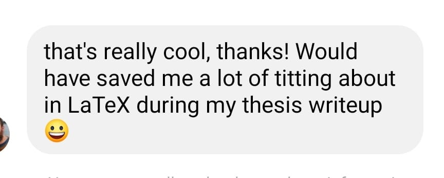

# Notation Converter

## What this does
Parses a user-input string by the whitespace between characters, converts certain phrases into symbols, and prints them in a text box:
| INPUT | OUTPUT |
| ------ | ------ |
| all y, all z (P(y) and exists xQ (x, y)) | ∀y, ∀z (P(y) ∧ ∃xQ (x, y))|
|HCO sub 3 sup -|HCO₃⁻|
| sigma sub x = 2 | σₓ = 2 |
| P(a <= x <= b) = integral function (x) dx |  P(a ≤ x ≤ b) = ∫ 𝑓(x) dx |
| P(a loe x loe b) = int fn (x) dx |  P(a ≤ x ≤ b) = ∫ 𝑓(x) dx |

## Why?
When scrolling through mathematics forums, Wikipedia etc., I noticed that people used:
 - LaTeX
 - Keyboard character substitutions
 - Copying from an ASCII table
 - JPEGS
 - HTML

The former is while powerful not always available, can be awkward to use and is primarily designed for typesetting. Substitutions are hard to read and awkward to write. Using JPEGs is often slow. Some HTML features cannot be copy/pasted.  
This is aimed at making quick, copy-pasteable sentences for use on forums & social media as such, making symbol keywords as intuitive as possible. 

## Reviews

## Acknowledgements 
The synchronised scrolling feature is imported from Dmitry Prokashev's excellent [Syncscroll](https://github.com/asvd/syncscroll) library.  
I received kind debugging assistance from Dart grandmaster [Alex Baker](https://github.com/alexobviously).
